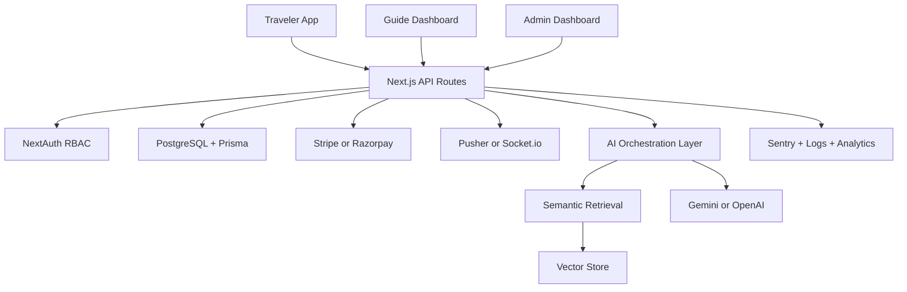

# Mytra Production Upgrade Plan

Mytra is evolving from a travel marketplace prototype into a production-grade AI travel platform. This document captures the target architecture, implementation phases, and demo-ready product direction.

## Current Product

Mytra connects travelers with verified local student guides. The app already includes guide discovery, city experiences, bookings, messaging, AI itinerary planning, safety/SOS flows, and admin management.

## Immediate Security Baseline

Implemented first:

- Booking ownership validation for SOS and location updates.
- Admin-aware booking access checks.
- Booking status finite state transitions.
- Shared admin guard for admin API routes.
- Route-level rate limiting for auth, AI itinerary, bookings, messaging, SOS, and location updates.

## Booking State Machine

Valid transitions:

- `PENDING -> CONFIRMED`
- `PENDING -> CANCELLED`
- `CONFIRMED -> COMPLETED`
- `CONFIRMED -> CANCELLED`

Terminal states:

- `COMPLETED`
- `CANCELLED`

## Target Architecture



## Database Upgrade

Move from SQLite to PostgreSQL for production. Recommended provider: Supabase PostgreSQL, Neon, Railway, or Render.

Add these production entities:

- `Payment`
- `SafetyEvent`
- `EmergencyContact`
- `GuideCertification`
- `GuideAvailabilitySlot`
- `TravelerProfile`
- `RecommendationEvent`
- `TrustScore`
- `Refund`

Add indexes on:

- `User.email`
- `User.role`
- `GuideProfile.status`
- `GuideProfile.cityId`
- `GuideProfile.rating`
- `GuideProfile.pricePerHour`
- `Booking.travelerId`
- `Booking.guideId`
- `Booking.status`
- `Booking.date`
- `Message.bookingId`
- `Notification.userId`

## AI Recommendation Engine

Build a hybrid scoring system before relying on LLMs.

Guide match score:

```text
score =
  cityMatch * 0.20 +
  languageMatch * 0.15 +
  interestsOverlap * 0.20 +
  budgetFit * 0.10 +
  ratingScore * 0.10 +
  responseRate * 0.10 +
  safetyFit * 0.10 +
  bookingHistoryFit * 0.05
```

Experience match score:

```text
score =
  interestsOverlap * 0.30 +
  budgetFit * 0.20 +
  durationFit * 0.15 +
  seasonalityFit * 0.10 +
  groupFit * 0.10 +
  popularity * 0.10 +
  weatherFit * 0.05
```

## Semantic Search

Create embeddings for:

- Guide bio
- Guide languages and interests
- Experience title and description
- City description
- Traveler preferences
- Reviews

Recommended first implementation:

- Generate embeddings during guide/experience create or update.
- Store vectors in PostgreSQL using `pgvector`.
- Use semantic search to retrieve top guides and experiences.
- Combine semantic score with business score.

## RAG Itinerary Pipeline

1. Validate request with Zod.
2. Retrieve city, experiences, approved guides, reviews, price ranges, and availability.
3. Rank retrieved items using the recommendation engine.
4. Pass only retrieved context to the LLM.
5. Ask the LLM for strict JSON.
6. Validate LLM output with Zod.
7. Reject or repair invalid output.
8. Return itinerary with explainable guide and experience recommendations.

## Marketplace Completion

Booking flow:

- Availability calendar.
- Booking request.
- Guide acceptance or rejection.
- Payment authorization.
- Booking confirmation.
- Traveler and guide messaging.
- Check-in prompts.
- Completion confirmation.
- Review and payout.

Payments:

- Use Razorpay for India-first UPI/card support or Stripe for global cards.
- Verify all payment webhooks.
- Store payment provider event IDs to prevent duplicate processing.
- Never trust client-side payment status.

## Safety Platform

Add:

- Emergency contacts.
- Scheduled check-ins.
- Live trip monitoring.
- Women safety preferences.
- Verified women guide filter.
- Incident reports.
- Admin safety dashboard.
- Audit log for SOS actions.

## Real-Time Messaging

Recommended stack:

- Pusher for easiest deployment on Vercel.
- Socket.io only if running a persistent Node server.

Features:

- Typing indicators.
- Read receipts.
- Image attachments.
- Message moderation.
- Booking-scoped chat rooms.

## Dashboard Roadmap

Traveler dashboard:

- Upcoming trips.
- Saved cities.
- Favorite guides.
- AI itineraries.
- Safety contacts.
- Travel history.

Guide dashboard:

- Booking requests.
- Availability.
- Earnings.
- Reviews.
- Certifications.
- Response time.

Admin dashboard:

- Revenue trend.
- Bookings by city.
- Guide approval queue.
- Fraud alerts.
- Safety incidents.
- Conversion funnel.
- Top guides and cities.

## DevOps

Add:

- Dockerfile.
- Docker Compose with PostgreSQL.
- GitHub Actions for lint, typecheck, test, build, and Prisma validation.
- Sentry for frontend and API error tracking.
- Vercel deployment.
- Managed PostgreSQL.
- Environment variable documentation.

## Investor Demo Story

Demo sequence:

1. Traveler enters city and preferences.
2. AI recommends itinerary, guides, and experiences.
3. Traveler sees match explanations.
4. Traveler books a verified student guide.
5. Guide accepts from dashboard.
6. Traveler and guide chat.
7. Safety check-in and SOS dashboard are shown.
8. Admin sees revenue, bookings, guide approvals, and fraud alerts.

## Placement Story

Resume positioning:

- Full-stack AI marketplace using Next.js, Prisma, PostgreSQL, NextAuth, and Gemini.
- Built role-based dashboards for traveler, guide, and admin workflows.
- Implemented secure booking ownership checks, status transitions, and rate limiting.
- Designed hybrid recommendation architecture using structured scoring and embeddings.
- Planned RAG-based itinerary generation grounded in real marketplace data.

## Priority Implementation Order

1. Finish security and authorization.
2. Complete signup, profiles, and guide onboarding.
3. Move database to PostgreSQL.
4. Complete real booking and payment flow.
5. Implement recommendation scoring.
6. Add embeddings and semantic search.
7. Upgrade itinerary generation to RAG.
8. Add real-time messaging.
9. Build analytics dashboards.
10. Add CI/CD, monitoring, Docker, and deployment docs.
